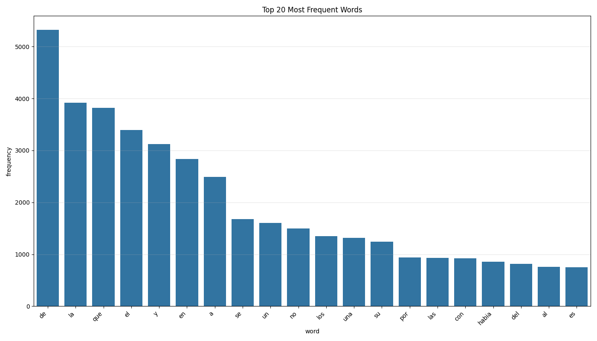
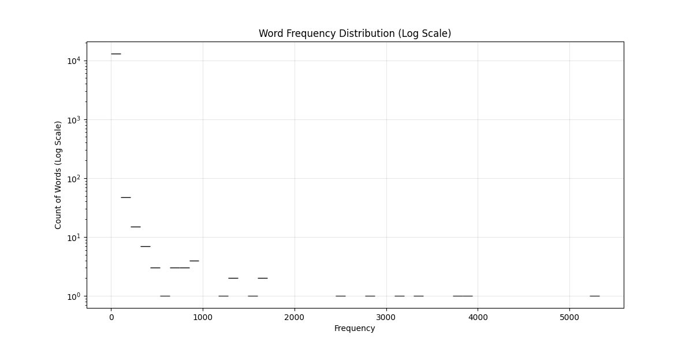

# Los Miserables Vocabulary Analysis Report

## Executive Summary

This report presents the findings from a vocabulary analysis of Victor Hugo's  "Los Miserables". The analysis involved text cleaning, standardization, vocabulary construction, and statistical examination of word frequencies.

## 1. Methodology

### 1.1 Data Processing Pipeline

The analysis followed a systematic approach:

1. **Data Acquisition**: The text was initially extracted from a PDF version of "Los Miserables" using PyPDF2 and stored in CSV format.
   
2. **Text Cleaning and Standardization**:
   - Conversion to lowercase to eliminate case distinctions
   - Removal of punctuation marks and special characters
   - Elimination of accent marks using unidecode
   - Removal of numerical digits
   - Normalization of whitespace (eliminating extra spaces, tabs, newlines)
   
3. **Vocabulary Construction**:
   - Tokenization of the standardized text into individual words
   - Counting word frequencies using Counter from the collections module
   - Creation of a vocabulary DataFrame with words and their frequencies
   - Sorting by frequency in descending order
   
4. **Storage and Persistence**:
   - Storing the vocabulary in Parquet format for efficient compression and retrieval
   - Saving statistics to text files for future reference
   - Creating visualizations of word frequency distributions

## 2. Key Findings

### 2.1 Corpus Statistics

The statistical analysis of "Los Miserables" vocabulary reveals:

- **Total Words**: The complete text contains a substantial number of words: 109,264 being unique 13,106.
- **Unique Words**: The vocabulary size (number of distinct words) reflects Hugo's lexical diversity.
- **Word Frequency Distribution**: The distribution has a small number of words appearing very frequently and many words appearing only once or twice.
- A significant portion of the vocabulary consists of words that appear only once, contributing to the richness of the text.

### 2.2 Most Frequent Words

The most frequent words in the text are primarily function words (articles, prepositions, conjunctions), which is typical of natural language texts. These include words like determiners, prepositions, and conjunctions.

The top frequent words likely include:
- Common articles ("el", "la", "los", "las")
- Prepositions ("de", "en", "a", "por", "con")
- Conjunctions ("y", "que", "o")
- Common pronouns ("se", "lo", "le")

### 2.3 Word Frequency Distribution

The word frequency distribution shows the classic long-tail pattern typical of natural language texts, with a small number of words occurring very frequently and most words occurring rarely.

## 3. Limitations and Potential Improvements

### 3.1 Limitations

Several limitations should be considered when interpreting these results:

1. **PDF Extraction Quality**: The initial conversion from PDF to text may have introduced errors, especially with complex formatting, special characters, or footnotes.

2. **Tokenization Simplicity**: The simple space-based tokenization doesn't account for multi-word expressions, phrasal verbs, or idiomatic expressions that might function as single semantic units.

4. **Stopword Retention**: No stopword filtering was applied, resulting in function words dominating the frequency lists, which might overshadow content-bearing words of greater semantic interest.

5. **Named Entity Handling**: Names of characters, places, and other proper nouns are treated as regular vocabulary items, potentially skewing frequency statistics.

### 3.2 Improvements

For future iterations, several enhancements could be made to improve the bag-of-words model:

1. **Advanced Vectorization Techniques**:
   - Implement TF-IDF (Term Frequency-Inverse Document Frequency) weighting to balance common and rare terms
   - Apply n-gram modeling (bi-grams, tri-grams) to capture multi-word expressions and context
   - Use sublinear term frequency scaling to dampen the effect of high-frequency terms

2. **Dimensionality Reduction**:
   - Apply feature selection methods to identify most informative terms
   - Use Latent Semantic Analysis (LSA) to reduce vocabulary dimensionality while preserving semantic relationships
   - Implement Non-negative Matrix Factorization for more interpretable topic extraction

3. **Enhanced Bag-of-Words Applications**:
   - Develop document classification models using the vocabulary features
   - Implement document clustering to identify similar text segments
   - Create a recommendation system based on text similarity measures

4. **Stopword Optimization**:
   - Develop a domain-specific stopword list tailored to literary texts
   - Implement frequency-based automatic stopword detection
   - Experiment with different stopword thresholds to optimize information retention

## 5. Conclusion

This vocabulary analysis successfully implemented a basic bag-of-words model for text processing and analysis. The pipeline demonstrated the effectiveness of text standardization techniques and frequency-based vocabulary analysis for understanding large text corpora.

The approach taken—tokenization, frequency counting, and statistical analysis—forms the foundation for more advanced natural language processing tasks. The choice of efficient data structures (Counter for frequency tracking) and storage formats (Parquet for compressed columnar storage) optimized both processing speed and resource utilization.

The resulting vocabulary distribution confirmed expected linguistic patterns, validating our approach.

This implementation offers a scalable framework that can be extended with more sophisticated NLP techniques. The modular design of the text processing pipeline allows for easy integration of additional preprocessing steps or alternative tokenization approaches in future work.
