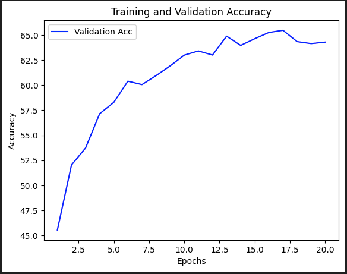
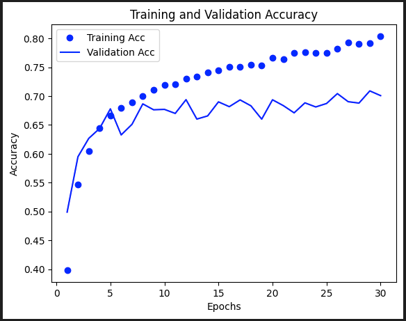
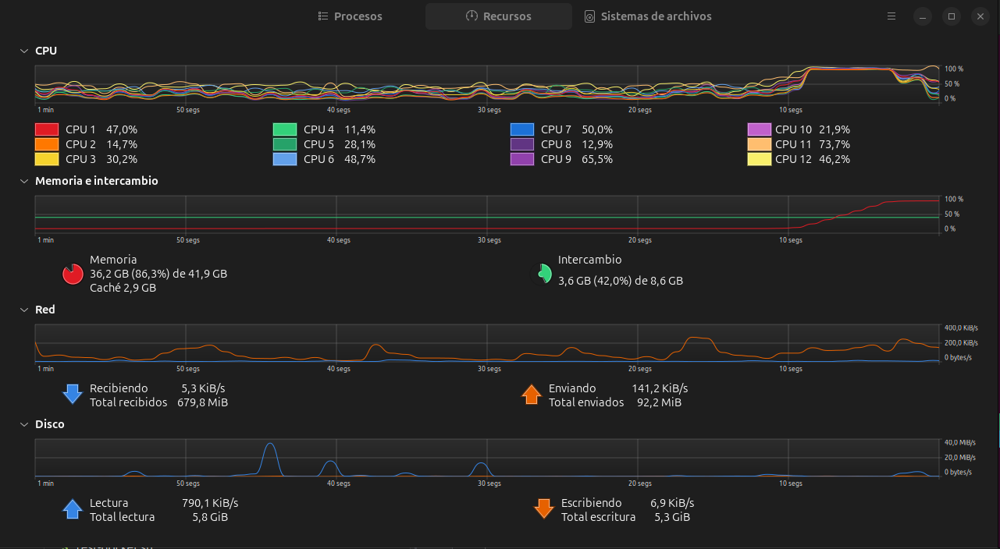
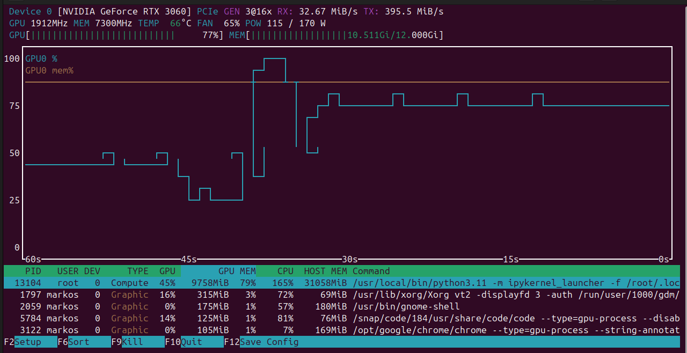

# Actividad AlexNet - Diplomado Inteligencia Artificial y Ciencia de Datos

## Objetivo principal

    Desarrollar el modelo AlexNet desde cero tanto en Pytorch como en TF/Keras

## Integrantes del equipo

    * Marcos Cortes Valadez
    * Cecilia Gomez Castañeda

## Actividades realizadas

### Desarrollando AlexNet desde cero en Pytorch 

    * Se analizó el código del modelo LeNet desde cero. Este código fue la base para comenzar con el desarrollo del modelo AlexNet en Pytorch
    * Se analizó un diagrama del modelo AlexNet tomado de la [wiki](https://en.wikipedia.org/wiki/AlexNet)
    * Para los parámetros de cada capa se revisó el modelo preentrenado que ofrece Pytorch por default, usando torchsummary
    * De la misma forma que en el modelo de Lenet usamos CIFAR10 para entrenar el modelo. Estas se tuvieron que redimensionar a 224x224 para que fueran admitidas por el modelo.
    * Las características de la máquina usada para realizar el entrenamiento son las siguientes
      * CPU: 12 nucleos
      * Memoria: 40GB
      * Almacenamiento: M.2 1TB
      * GPU: NVIDIA GeForce RTX 3060 12GB
    * El modelo se entrenó para 20 epocas demorando 21min 42seg
        
    * Con un accuracy de 64%

### Desarrollando AlexNet desde cero en TF/Keras

    * Tomando como base el modelo desarrollado en Pytorch se usaron las mismas capas y parámetros para crear el modelo en TF/Keras
    * También para el entrenamiendo de este modelo se usaron las imágenes de CIFAR10, las cuales tambien se redimensionan a 224x224
    * Se realizó el entrenamiendo en la misma máquina para 20 epocas
    * Para 20 epocas el entrenamiento demoró casi el mismo tiempo de 20min
    * Se realizó un segundo entrenamiendo con 30 épocas tomando un total de 29min
      *  
    * Con un accuracy de 81%

### Conclusión

    * Realizando la comparación del accuracy entre los tres modelos tenemos lo siguiente:
        | Pytorch from scratch      | Keras from scratch    | Pretrained Pytorch    |
        | -----------               | -----------           | -----------           | 
        |                    67%    |                   81% |                   78% |

    * Vemos que el accuracy del modelo creado en Keras es mucho más alto que lo que se obtuvo con Pytorch
    * Analizaremos nuevamente el modelo y como fue entrenado el modelo para revisar si se cometió algún error
    * Observamos que ambas bibliotecas Pytorch y Keras son relativamente fáciles de usar para crear modelos, aunque tienen sus diferencias
    * Es importante medir la cantidad de recursos que se tienen en la máquina ya que para el entrenamiento se ocupa todos o la mayoria. Se muestran algunas capturas
        
        

